flaschenclient
=======
A python library for sending simple animations to the flaschen taschen server (fork). 
Currently it's only working with the forked server which can be found here:
https://github.com/werling/flaschen-taschen

Before using this library please have a look at the original project: https://github.com/hzeller/flaschen-taschen

Some examples how to use the python library can be found in the examples folder.
The test display has the resolution 256x96.

The main features are:

### loading and playing images/gifs
Also defining the width, height, duration and the layer of the image/gif

``` FlaTaClient.send(im, width=64, height=64, timeout=10, layer=2) ```

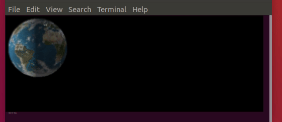

### Define the position of the image/gif
``` FlaTaClient.send(im, width=64, height=64, timeout=10, layer=2, x_offset=128-32, y_offset=48-32) ```

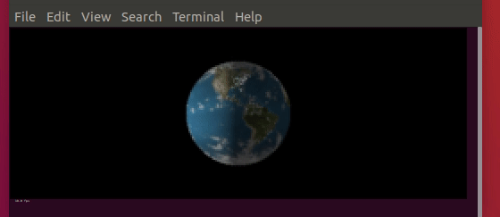

### Blur in and/or blur out
``` FlaTaClient.send(im, width=64, height=64, timeout=4, layer=2, x_offset=128-32, y_offset=48-32, blur_out_frames=10)```

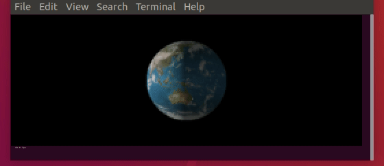

### Move image/gif with constant speed
``` FlaTaClient.send(im, width=64, height=64, timeout=10, layer=2, x_offset=0, y_offset=48-32, x_vel=4)```


### Move image/gif with acceleration
``` FLaTaClient.send(im, width=64, height=64, timeout=10, layer=2, x_offset=0, y_offset=0, x_vel=12, y_gravity=1)```

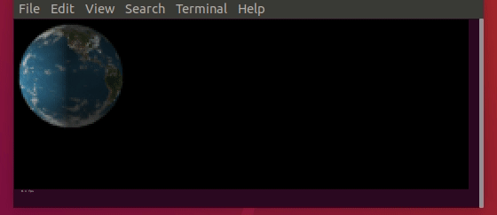

### Rotate image/gif with constant or acceleration speed
``` FlaTaClient.send(im, width=64, height=64, timeout=10, layer=2, x_offset=0, y_offset=0, rot_vel=20)```

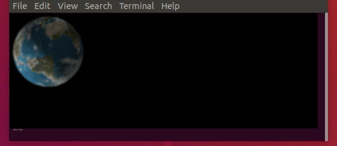

### Limits, Default mode is stop all motion when a limit is exceeded
``` FlaTaClient.send(im, width=64, height=64, timeout=10, layer=2, y_offset=48-32, x_min=0, x_max=256-64, y_min=0, y_max=96-64, x_vel=8) ```

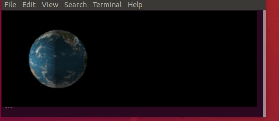

### Limits, mode: inverse all motion directions when exceeding a limit
``` FlaTaClient.send(im, width=64, height=64, timeout=10, layer=2, y_offset=48-32, x_min=0, x_max=256-64, y_min=0, y_max=96-64, x_vel=8, y_vel=2, action_at_limit="inverse_all")```

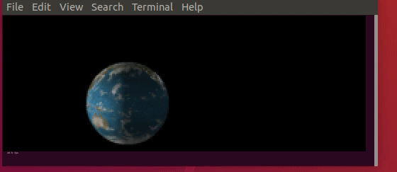

### Limits, mode: inverse only the motion direction which exceeded a limit
``` FlaTaClient.send(im, width=64, height=64, timeout=10, layer=2, y_offset=48-32, x_min=0, x_max=256-64, y_min=0, y_max=96-64, x_vel=8, y_vel=2, action_at_limit="inverse_single") ```

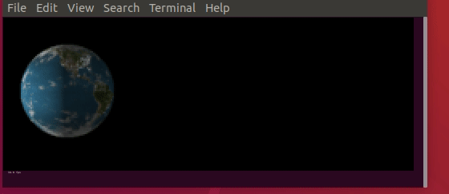

### Limits, mode: stop the motion which exceeded a limit
``` FlaTaClient.send(im, width=64, height=64, timeout=10, layer=2, y_offset=48-32, x_min=0, x_max=256-64, y_min=0, y_max=96-64, x_vel=8, y_vel=2, action_at_limit="stop_single") ```

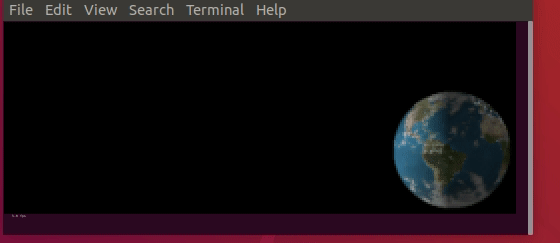

### Zooming and Limits
``` FlaTaClient.send(im, width=64, height=64, timeout=10, layer=2, x_offset=128-32, y_offset=48-32, action_at_limit="inverse_all", zoom_vel=2, width_max=128, width_min=8) ```

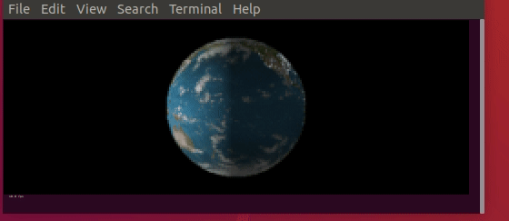

### Of course you also can do all at once ;)

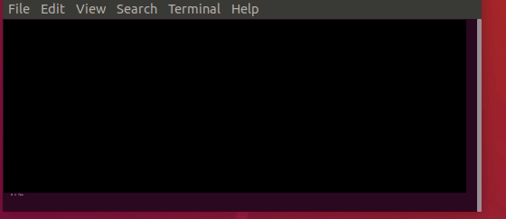
